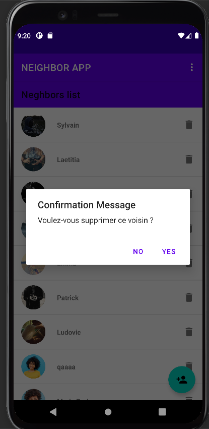

# TP Android MBDS
- 2021-2022
- Professeur : Amosse EDOUARD

# TP1
*Branch * : main

### Réalisations
1. Afficher le nombre de fois qu'on a cliqué sur un bouton
* Contraintes :
- [x] TextView invisible si le nombre de clique est 0
- [x] Bouton le grisé après 5 cliques
#### Visualisation

2. Calcul dans l'activité ComputeActivity
* Contraintes :
- [x] Désactivez le bouton que les deux champs de texts ne sont pas renseignés
- [x] L'utilisateur ne doit pouvoir rentrer uniquement des nombres dans les champs de texts
#### Visualisation

# TP2-TP3-TP4
*Branch * : main (TP2-TP3)
1. Ajouter un nouveau voisin
* Contraintes :
- [x] Tous les champs sont obligatoires
- [x] L'email doit être valide (afficher une erreur sous le champ email indiquant à l'utilisateur qu'il y a une erreur)
- [x] Le bouton reste grisé tant que tous les champs ne sont pas validés
- [x] Le téléphone doit être valide (commencant par 06 ou 07 et doit avoir 10 charactères) -- (afficher une erreur sous le champ téléphone indiquant à l'utilisateur que le format doit être 0X XX XX XX XX XX)
- [x] Le champ bio A propos de moi doit autoriser au maximum 30 charactères
- [x] Les champs Image et Website doivent être des liens valides
- [x] Quand l'utilisateur rempli le champ Image avec un lien valide, afficher automatiquement un visuel de l'image à la place de l'image par défaut tout en haut.

#### Visualisation

*Branch * : room (TP4)

#### Visualisation

